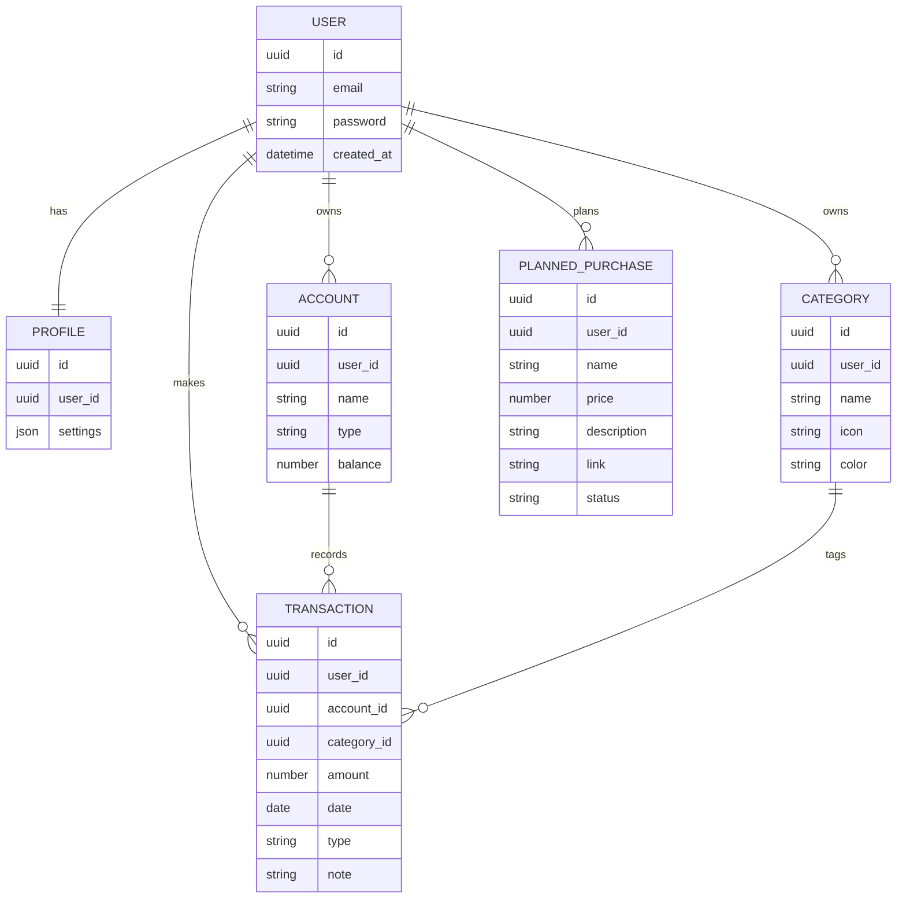

# Технический документ: персональный учет финансов

## 1. Обзор
Цель проекта: веб‑приложение для персонального учета финансов с возможностью дальнейшего переноса логики и интерфейса в мобильное приложение.

Основные задачи пользователя:
- Вести профиль.
- Учитывать расходы по категориям.
- Учитывать счета/кошельки разных типов.
- Смотреть историю операций.
- Получать аналитику и статистику.
- Планировать крупные покупки.

## 2. Стек технологий (MVP)
- Python
- Django 6.0
- Django REST Framework
- База данных: PostgreSQL (в Docker) / SQLite (локально)
- Аутентификация: JWT (SimpleJWT)
- Docker + Docker Compose

Стек может расширяться по мере развития проекта.

## 3. Функциональные разделы

### 3.1. Профиль пользователя
- Регистрация/вход.
- Хранение персональных настроек.

### 3.2. Главная вкладка: «Траты»
- Выбор категории трат (базовые + пользовательские).
- Базовые категории (начальные):
  - Продукты
  - Кафе
  - Покупки
  - Досуг
  - Транспорт
  - Подарки
  - Здоровье
  - Семья
- Пользователь может добавлять свои категории.
- Визуализация: круговая диаграмма пропорций по категориям.
  - Каждый тип затрат — отдельный сектор круга.
  - Сектора различаются цветами и иконками.
  - Диаграмма строится по месяцу (активный месяц).

### 3.3. Счета
- Разные типы счетов: вклад, наличные, карта и т.п.
- Привязка операций к счету.

### 3.4. Операции
- История операций по датам.
- Фильтрация и сортировка (позже).

### 3.5. Обзор (аналитика)
- Графики и статистика:
  - Сколько потрачено/заработано.
  - Средние траты в день.
  - Итоги за месяц.
  - Итоги «сегодня».
- В блоке месяца: три полосы (расходы, сбережения, доходы).

### 3.6. Запланированные покупки
- Список целей.
- Поля:
  - Название
  - Цена (задается пользователем)
  - Описание
  - Ссылка на покупку

## 4. Архитектура (в общих чертах)
- Backend: Django + DRF API.
- Frontend: на данном этапе не фиксирован (веб‑клиент), перспективно — мобильное приложение.
- Данные и бизнес‑логика проектируются так, чтобы быть переиспользуемыми при переносе в мобильный клиент.

## 5. Основные сущности (черновик)

### User
- id
- email/username
- password
- created_at

### Profile
- user_id
- настройки/предпочтения

### Category
- id
- user_id (nullable для базовых категорий)
- name
- icon
- color

### Account
- id
- user_id
- name
- type (вклад, наличные, карта и т.д.)
- balance (опционально, если будем вести остатки)

### Transaction
- id
- user_id
- account_id
- category_id
- amount
- date
- type (расход/доход)
- note (опционально)

### PlannedPurchase
- id
- user_id
- name
- price
- description
- link
- status (опционально)

## 6. API (черновик направлений)
- Auth: регистрация, login, refresh.
- Profile: получение/обновление.
- Categories: CRUD (базовые + пользовательские).
- Accounts: CRUD.
- Transactions: CRUD + фильтрация по датам/категориям/счетам.
- Analytics: агрегированные данные (по месяцам/дням).
- Planned Purchases: CRUD.

## 6.1. ER‑диаграмма (текстовая)
Сущности и связи (черновой вариант):
- User 1→1 Profile
- User 1→N Category
- User 1→N Account
- User 1→N Transaction
- User 1→N PlannedPurchase
- Account 1→N Transaction
- Category 1→N Transaction

Минимальный набор полей:
- User: id, email/username, password, created_at
- Profile: id, user_id, settings (json)
- Category: id, user_id (nullable для базовых), name, icon, color
- Account: id, user_id, name, type, balance (опционально)
- Transaction: id, user_id, account_id, category_id, amount, date, type, note (опционально)
- PlannedPurchase: id, user_id, name, price, description, link, status (опционально)

Примечания:
- Базовые категории хранятся с `user_id = NULL`.
- При удалении пользователя нужно каскадно удалять его данные.

## 6.1.1. ER‑диаграмма (Mermaid)

## 6.1.2. ER‑диаграмма (PNG)
- Файл: `finance-tracker-docs/er-diagram.png`

## 6.2. API‑контракты (расширенный черновик)
Формат запросов/ответов JSON. Все защищенные endpoints требуют `Authorization: Bearer <access>`.
CRUD‑семантика:
- Create: `POST /resource`
- Read: `GET /resource` и `GET /resource/{id}`
- Update (полная замена): `PUT /resource/{id}` — передаются все поля ресурса
- Update (частичное изменение): `PATCH /resource/{id}` — передаются только изменяемые поля
- Delete: `DELETE /resource/{id}`
Предпочтительный вариант для UI:
- Используем `PATCH` как основной способ обновления (минимальные payload).
- `PUT` опционален и может не реализовываться в MVP.

Пример улучшенного CRUD (с упором на PATCH)
Resource: Transaction
- Create:
  - POST /api/transactions
  - body: { account_id, category_id, amount, date, type, note? }
- Read list:
  - GET /api/transactions?from=YYYY-MM-DD&to=YYYY-MM-DD&category_id=&account_id=&type=
- Read one:
  - GET /api/transactions/{id}
- Update (частично):
  - PATCH /api/transactions/{id}
  - body (пример): { amount: 1250, note: "Обновил сумму" }
- Delete:
  - DELETE /api/transactions/{id}

Auth
- POST /api/auth/register
  - body:
    - email (string)
    - password (string)
  - response:
    - id (uuid)
    - email (string)
    - access (jwt)
    - refresh (jwt)
- POST /api/auth/login
  - body: { email, password }
  - response: { access, refresh }
- POST /api/auth/refresh
  - body: { refresh }
  - response: { access }

Profile
- GET /api/profile
  - response: { id, email, settings }
- PATCH /api/profile
  - body: { settings }
  - response: { id, email, settings }

Categories
- GET /api/categories
  - query:
    - include_defaults (bool, optional, default true)
  - response: [{ id, name, icon, color, is_default }]
- GET /api/categories/{id}
  - response: { id, name, icon, color, is_default }
- POST /api/categories
  - body: { name, icon, color }
  - response: { id, name, icon, color, is_default }
- PUT /api/categories/{id}
  - body: { name, icon, color }
  - response: { id, name, icon, color }
- PATCH /api/categories/{id}
  - body: { name?, icon?, color? }
  - response: { id, name, icon, color }
- DELETE /api/categories/{id}
  - response: { ok: true }

Accounts
- GET /api/accounts
  - response: [{ id, name, type, balance }]
- GET /api/accounts/{id}
  - response: { id, name, type, balance }
- POST /api/accounts
  - body: { name, type, balance? }
  - response: { id, name, type, balance }
- PUT /api/accounts/{id}
  - body: { name, type, balance? }
  - response: { id, name, type, balance }
- PATCH /api/accounts/{id}
  - body: { name?, type?, balance? }
  - response: { id, name, type, balance }
- DELETE /api/accounts/{id}
  - response: { ok: true }

Transactions
- GET /api/transactions
  - query:
    - from (YYYY-MM-DD, optional)
    - to (YYYY-MM-DD, optional)
    - category_id (uuid, optional)
    - account_id (uuid, optional)
    - type (expense|income, optional)
    - limit (int, optional)
    - offset (int, optional)
  - response: [{ id, account_id, category_id, amount, date, type, note }]
- GET /api/transactions/{id}
  - response: { id, account_id, category_id, amount, date, type, note }
- POST /api/transactions
  - body: { account_id, category_id, amount, date, type, note? }
  - response: { id, account_id, category_id, amount, date, type, note }
- PUT /api/transactions/{id}
  - body: { account_id, category_id, amount, date, type, note? }
  - response: { id, account_id, category_id, amount, date, type, note }
- PATCH /api/transactions/{id}
  - body: { account_id?, category_id?, amount?, date?, type?, note? }
  - response: { id, account_id, category_id, amount, date, type, note }
- DELETE /api/transactions/{id}
  - response: { ok: true }

Analytics
- GET /api/analytics/summary
  - query:
    - month (YYYY-MM, required)
  - response:
    - total_income (number)
    - total_expense (number)
    - avg_daily_expense (number)
    - today_expense (number)
- GET /api/analytics/categories
  - query:
    - month (YYYY-MM, required)
  - response: [{ category_id, total, percent }]
- GET /api/analytics/daily
  - query:
    - month (YYYY-MM, required)
  - response: [{ date, total_expense, total_income }]

Planned Purchases
- GET /api/planned-purchases
  - response: [{ id, name, price, description, link, status }]
- GET /api/planned-purchases/{id}
  - response: { id, name, price, description, link, status }
- POST /api/planned-purchases
  - body: { name, price, description, link, status? }
  - response: { id, name, price, description, link, status }
- PUT /api/planned-purchases/{id}
  - body: { name, price, description, link, status? }
  - response: { id, name, price, description, link, status }
- PATCH /api/planned-purchases/{id}
  - body: { name?, price?, description?, link?, status? }
  - response: { id, name, price, description, link, status }
- DELETE /api/planned-purchases/{id}
  - response: { ok: true }

Ошибки (общие)
- 400: ошибка валидации
- 401: неавторизован
- 403: нет доступа
- 404: не найдено

## 6.3. План релизов (roadmap)
MVP (база):
- Регистрация/вход, профиль
- Категории (базовые + пользовательские)
- Счета
- Транзакции (расходы/доходы)
- Главная диаграмма (API под данные)
- История операций
- Обзор статистики (минимальные показатели)
- Запланированные покупки

V1 (расширение):
- Фильтры и сортировки операций
- Продвинутая аналитика (графики по периодам)
- Экспорт данных (CSV/JSON)
- Роли/ограничения доступа (если потребуется)
- Google OAuth вход (заменяет/дополняет email+password)

V2 (дальше):
- Бюджеты и лимиты по категориям
- Уведомления и напоминания
- Мультивалюта
- Мобильный клиент

## 7. Развертывание
- Локально: SQLite.
- Прод: PostgreSQL в Docker.
- Контейнеризация: Docker + Docker Compose.

## 8. Неопределенности/будущие решения
- Выбор фронтенда (веб: React/Vue/Svelte и т.д.).
- Дизайн API под мобильный клиент.
- Локализация, мультивалюта.
- Импорт/экспорт данных.
- Бюджеты, лимиты, уведомления.

## 9. Минимальный набор задач (MVP)
- Пользователь: регистрация/вход.
- Категории: базовые + пользовательские.
- Счета.
- Транзакции (расходы/доходы).
- Главная диаграмма (API для данных).
- История операций.
- Обзор статистики.
- Запланированные покупки.

---
Документ предназначен как исходная спецификация. При расширении требований разделы дополняются и уточняются.
